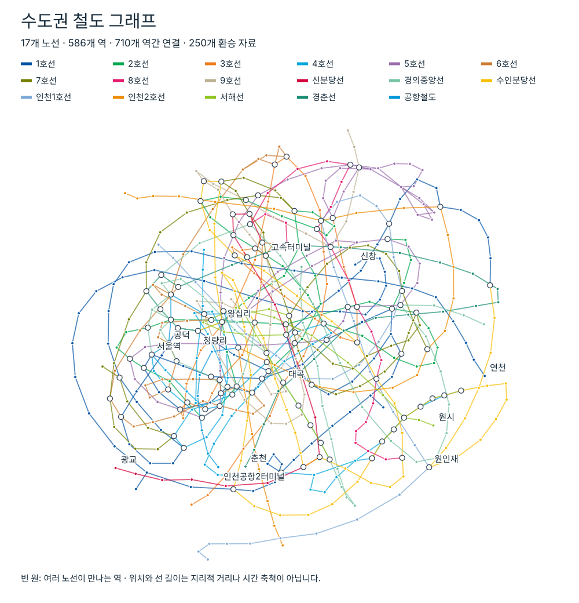
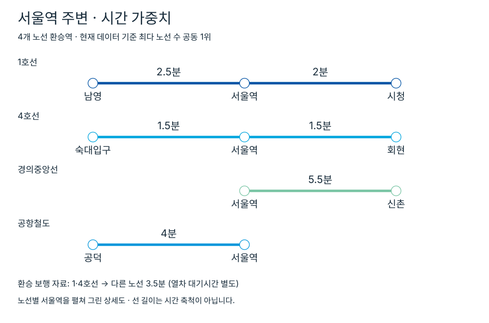

# 어디서 만나

여러 사람의 출발역을 받아 이동시간이 비슷한 약속역을 추천하는 앱인토스 WebView MVP입니다. 현재 로컬 데이터에는 17개 노선, 586개 역, 역간 연결 710개, 환승 연결 250개가 들어 있습니다.

## 실행

```bash
bun install
bun run dev
```

일반 WebView 빌드는 `bun run build:web`, 앱인토스 업로드용 `.ait` 번들은 `bun run build`, 추천 및 검색 로직 검증은 `bun test`로 실행합니다.

## 앱인토스 설정

- 콘솔 `appName`: `eodiseomanna`
- 앱 노출 이름: `어디서 만나`
- 딥링크: `intoss://eodiseomanna`
- 설정 파일: `apps-in-toss.config.ts`
- SDK: `@apps-in-toss/web-framework` 3.x

`bun run dev`로 실행하면 AIT Devtools가 포함된 로컬 테스트 환경을 사용할 수 있습니다. 업로드 번들은 아래 명령으로 만듭니다.

```bash
bun run build
```

생성된 `.ait` 파일을 앱인토스 콘솔의 **앱 출시 → 등록하기**에서 업로드합니다. 콘솔 QR 테스트를 완료한 뒤 검수를 요청합니다.

## 지원 범위

- 참여자 2~6명과 출발역 입력
- 서울 도시철도 1~9호선
- 인천 도시철도 1·2호선
- 공항철도 일반열차
- 경의중앙선과 서울역 지선
- 경춘선 일반열차
- 수인분당선
- 서해선 원시–일산 운행 구간
- 신분당선
- 한글, 초성, `춘ㅊ` 같은 혼합 검색
- 사람별 복수 출발역과 역까지의 접근시간을 지원하는 도메인 모델

## 데이터 그래프

서비스에 사용하는 역·노선 연결과 시간 가중치를 나타낸 그래프입니다.

[](https://lyllyl-bp.github.io/eodiseomanna/graph/)

[](https://lyllyl-bp.github.io/eodiseomanna/graph/)

[인터랙티브 그래프 보기](https://lyllyl-bp.github.io/eodiseomanna/graph/)

## 원본 자료와 활용 방법

원본 파일은 용량과 배포 조건 때문에 저장소에 포함하지 않습니다. `scripts/generate_transit_data.py`가 CSV와 XLSX를 읽어 브라우저에서 바로 사용할 수 있는 `src/data/network.generated.ts`를 만듭니다.

| 자료 | 적용 노선 | 활용 방법 |
| --- | --- | --- |
| [서울교통공사 열차운행시각표 CSV](https://www.data.go.kr/cmm/cmm/fileDownload.do?atchFileId=FILE_000000007644502&fileDetailSn=1&insertDataPrcus=N) | 1~9호선 | 평일(`DAY`) 일반열차만 사용합니다. 열차코드별 정차역을 시간순으로 정렬한 뒤 현재 역 출발시각과 다음 역 도착시각의 차이를 역간 운행시간 표본으로 만듭니다. |
| [서울교통공사 환승정보 CSV](https://www.data.go.kr/cmm/cmm/fileDownload.do?atchFileId=FILE_000000007644508&fileDetailSn=1&insertDataPrcus=N) | 모든 지원 노선의 수도권 환승역 | `소요시간`을 환승 보행시간으로 사용합니다. 도착 역코드로 상대 노선을 찾고, 코드가 없는 운영기관 노선은 같은 역을 공유하는 노선과 연결합니다. |
| [한국철도공사 광역철도 시간표](https://www.korail.com/com/userBoard.do?mode=list&schBcid=ticketTable) | 수인분당선 | 2026년 8월 22일 개정 XLSX의 평일·휴일 상하행 시트를 읽습니다. 각 열차 열에서 인접 역의 출발·도착시각 차이를 수집합니다. |
| [한국철도공사 광역철도 시간표](https://www.korail.com/com/userBoard.do?mode=list&schBcid=ticketTable) | 경의중앙선, 경춘선, 서해선 | 2026년 9월 1일 개정 XLSX의 노선별 상하행 시트를 읽습니다. 경의선 서울역 지선도 경의중앙선 그래프에 포함합니다. 서해선은 실제 시각이 채워진 원시–일산 구간만 사용합니다. ITX-청춘과 광운대 직결 운행은 제외합니다. |
| [인천교통공사 운영개요](https://www.ictr.or.kr/main/railway/intro.jsp) | 인천 1·2호선 | 운영기관이 공개한 역 순서와 각 역의 이전 역 대비 소요시간을 생성 스크립트의 정적 입력으로 옮겼습니다. 인천 1호선은 검단호수공원 연장 구간까지 포함합니다. |
| [공항철도 열차운행시각표](https://www.arex.or.kr/contentView.do?contentNo=CT202512190000000006&etcNo=&menuNo=MN202602270000000003) | 공항철도 | 2025년 12월 29일 개정 XLSX의 평일·휴일 상하행을 읽습니다. 비고가 `직통`인 열차는 제외하고 14개 역에 모두 정차하는 일반열차만 사용합니다. 다운로드가 막힐 때는 [국가철도공단 철도산업정보센터 사본](https://www.kric.go.kr/jsp/board/portal/sub01/railNewsDetail.jsp?p_id1=M01060101&p_id2=677881)을 사용할 수 있습니다. |
| [신분당선 역간 소요시간](https://www.shinbundang.co.kr/dxline/dxline3_2.jsp) | 신분당선 | 운영기관의 역 순서로 노선을 구성합니다. 현재 MVP에서는 인접 역마다 3분을 적용한 추정치이며, 출시 전 공식 구간별 시간으로 교체해야 합니다. |

## 데이터 생성 규칙

1. 기관별 약칭과 표기를 하나의 역명으로 정규화합니다. 예를 들어 `디엠시`는 `디지털미디어시티`, `신김포`는 `김포공항`, `평내호`는 `평내호평`으로 합칩니다.
2. 각 열차의 현재 역 출발시각에서 다음 역 도착시각까지를 하나의 역간 시간 표본으로 만듭니다.
3. 자정 이후 운행은 다음 날로 보정합니다. 20초 미만이거나 20분을 넘는 값은 잘못된 표본으로 보고 제외합니다.
4. 상행·하행과 여러 열차에서 모은 표본의 중앙값을 사용합니다. 결과는 0.5분 단위로 반올림합니다.
5. 역간 연결은 양방향으로 저장합니다. 방향별 시간 차이는 현재 MVP에서 구분하지 않습니다.
6. 환승시간도 동일한 환승 조합의 중앙값을 0.5분 단위로 저장합니다.
7. 생성 결과에는 원본 시간표 전체가 아니라 노선 정보, 역간 시간, 환승시간만 들어갑니다. 앱 실행 중에는 pandas나 XLSX 파일이 필요하지 않습니다.

생성 스크립트는 Python 3, `pandas`, `openpyxl`이 필요합니다.

```bash
python3 scripts/generate_transit_data.py \
  --seoul /path/to/seoul-timetable.csv \
  --transfers /path/to/seoul-transfer.csv \
  --suin-bundang /path/to/suin-bundang.xlsx \
  --gyeongui /path/to/gyeongui-weekday.xlsx \
  --arex /path/to/arex-timetable.xlsx \
  --output src/data/network.generated.ts
```

성공하면 현재 데이터 기준으로 다음과 같은 요약이 출력됩니다.

```text
Generated 17 lines, 710 ride edges, 250 transfer edges
```

## 이동시간 계산

`LocalNetworkProvider`는 `(노선, 역)`을 하나의 그래프 노드로 사용합니다. 같은 열차로 다음 역에 가는 연결에는 생성된 역간 시간이, 다른 노선으로 바꾸는 연결에는 환승시간이 적용됩니다.

- 첫 열차 탑승: 노선별 평균 대기시간을 더합니다.
- 자료가 있는 환승: 환승 보행시간과 갈아탈 노선의 평균 대기시간을 더합니다.
- 자료가 없는 환승: 보행과 대기를 합친 5분을 적용합니다.
- 출발역과 도착역이 같을 때: 열차 대기시간 없이 접근시간만 적용합니다.
- 복수 출발역: `접근시간 + 지하철 이동시간`이 가장 짧은 출발역을 선택합니다.
- 최단경로: 다익스트라 알고리즘으로 이동시간을 최소화하며, 시간이 같으면 환승이 적은 경로를 선택합니다.

현재 적용하는 노선별 평균 대기시간은 다음과 같습니다. 실시간 배차를 조회하는 값이 아니라 MVP용 정적 가정입니다.

| 노선 | 대기시간 | 노선 | 대기시간 |
| --- | ---: | --- | ---: |
| 1호선 | 3분 | 2호선 | 2분 |
| 3호선 | 3분 | 4호선 | 3분 |
| 5호선 | 3분 | 6호선 | 4분 |
| 7호선 | 3분 | 8호선 | 4분 |
| 9호선 | 4분 | 신분당선 | 3분 |
| 경의중앙선 | 7분 | 수인분당선 | 6분 |
| 인천 1호선 | 4분 | 인천 2호선 | 3분 |
| 서해선 | 7분 | 경춘선 | 7분 |
| 공항철도 | 4분 |  |  |

## 중간역 추천 기준

모든 역을 후보로 두고 참여자별 최단 이동시간을 계산합니다.

1. 후보별로 가장 오래 걸리는 사람의 시간을 구합니다.
2. 이 값이 전체 최솟값보다 5분 이내인 후보만 남깁니다.
3. 남은 후보를 참여자 간 시간 차이, 평균 이동시간, 최대 이동시간, 총 환승 횟수 순으로 정렬합니다.
4. 상위 3개 역을 추천합니다.

이 방식은 한 사람에게 지나치게 먼 장소를 먼저 제한한 뒤, 허용 범위 안에서 도착시간이 비슷한 장소를 고릅니다.

## 한계와 교체 계획

- 시간표 기반 평균값이므로 지연, 운휴, 혼잡, 도보 속도와 실시간 배차는 반영하지 않습니다.
- 1~9호선 급행, 공항철도 직통열차, ITX-청춘은 제외합니다.
- 신분당선 인접 역 시간은 현재 3분 추정치입니다.
- 운영기관 환승 자료에 없는 조합은 5분으로 계산합니다.
- 방향과 시간대에 따른 역간 시간 차이를 하나의 중앙값으로 합칩니다.
- 개통·연장과 시간표 개정이 있을 때 원본 파일을 다시 받아 생성해야 합니다.

추천 로직은 `TravelTimeProvider` 인터페이스만 사용합니다. 현재 `LocalNetworkProvider` 대신 TAGO나 유료 길찾기 API 공급자를 같은 인터페이스로 구현하면 추천 정책과 UI를 유지한 채 실제 경로 데이터로 전환할 수 있습니다.

```text
참여자 입력 → TravelTimeProvider → 공통 JourneyMatrix → 중간역 추천 → 결과 화면
```
